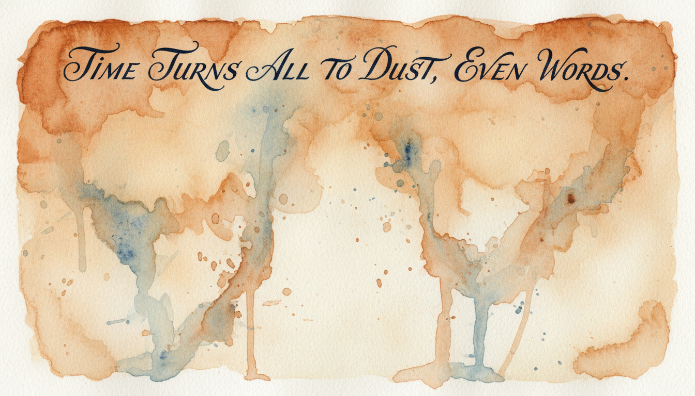

# Claude Enforcer

Most people focus on what to *say* to AI. The real leverage is in what you *show* it before you speak.

[Claude Code](https://docs.anthropic.com/en/docs/claude-code) is Anthropic's command-line AI assistant for software development. When you run it in a project directory, it reads a `CLAUDE.md` file at the start of every conversation. This file is where you write the rules: your project's architecture, coding conventions, API keys to avoid, workflows to follow. Everything Claude needs to know before it touches your code.

The problem is that rules fade. As conversations grow longer, the instructions you loaded at the start get diluted by everything that comes after. Researchers call this ["lost in the middle"](https://arxiv.org/abs/2307.03172), and it means your carefully written rules stop being consulted reliably.

This tool helps you build a context system that resists drift.



## The Problem

When you put everything in `CLAUDE.md`, two things happen:

1. **Context bloat.** Every conversation loads every rule, even irrelevant ones. A 500-line file full of deployment procedures wastes context when you're just trying to fix a CSS bug.

2. **Instruction drift.** You write a rule that says "never commit without running tests." For the first twenty messages, Claude follows it. By message forty, it commits without running tests. The rule is still there in the context window. The model just stops reaching for it.

## The Solution

Claude Code has three mechanisms that help, but most developers underuse them:

**Skills** are reusable instruction files that load on-demand. Instead of a 500-line `CLAUDE.md` that fades, you have a lean set of essentials (~100 lines) plus specialized skills you invoke when needed. Type `/deploy` when deploying, `/api` when working with your API, `/review` when reviewing code. The context stays relevant.

**Hooks** are shell scripts that run *before* Claude acts. A PreToolUse hook can block a forbidden action regardless of what Claude "remembers." It doesn't matter if the model forgot your rule about never using a certain account. The hook blocks it anyway.

**Agents** are subprocesses that start with fresh context. When you need to validate something without the drift of the current conversation, you spawn an agent with `context: none`. It reads your reference files directly, uninfluenced by the long conversation above. Each agent gets a distinct persona, a specific expert lens, so that when multiple agents evaluate the same problem, they bring genuinely different perspectives rather than echoing each other.


**Agent Teams** coordinate multiple Claude Code instances working in parallel. Where individual agents evaluate independently and report back, teammates share a task list, message each other, and divide labor across files. Think of the difference this way: individual agents are expert witnesses who testify separately; a team is a crew building different parts of the same house.

## Requirements

Claude Code **v2.1.32 or later**. Skills became user-invocable in v2.1.3 (January 2026). Earlier versions will refuse to run `/skill-builder` directly. Check with `claude --version` and update with `claude update` if needed.

## Install

**1.** Initialize Claude Code (if you haven't already):

```bash
claude /init
```

**2.** Install/Update skill-builder:

```bash
bash -c "$(curl -fsSL https://raw.githubusercontent.com/odysseyalive/claude-enforcer/main/install)"
```

**3.** Open Claude Code and run your first audit:

```
/skill-builder audit
```

## Usage

```
/skill-builder                  # Full audit of CLAUDE.md + all skills + rules + agents
/skill-builder audit            # Same as above
/skill-builder audit --quick    # Lightweight: frontmatter + line counts + priority fixes
/skill-builder verify           # Health check: validate all skills, hooks, wiring
/skill-builder skills           # List all local skills available in this project
/skill-builder list [skill]     # Show all modes/options for a skill
/skill-builder new [name]       # Create a new skill from template
/skill-builder optimize [skill] # Restructure a specific skill
/skill-builder agents [skill]   # Analyze and create agents for a skill
/skill-builder hooks [skill]    # Inventory existing hooks + identify new opportunities
/skill-builder inline [skill] [directive]  # Quick-add a directive to a skill
/skill-builder ledger           # Create an Awareness Ledger for institutional memory
/skill-builder update           # Update skill-builder to the latest version
```

The audit scans your `CLAUDE.md`, any `.claude/rules/` files, and existing skills. It identifies what can be extracted, what needs enforcement, and where context drift is likely to cause problems.

The `--quick` flag runs a lightweight version: frontmatter checks, line counts, hook wiring validation, and a priority fix list. No deep structural analysis. Use it for iterative work sessions where a full audit would slow you down.

The `verify` command is a non-destructive health check that validates all skills, hooks, and wiring without modifying anything. It's headless-compatible: `claude -p "/skill-builder verify"` works for CI or pre-commit checks.

## Building Skills

You'll always be tweaking. A skill that works today might need adjustment next week as you discover edge cases, add new rules, or realize something drifts when it shouldn't.

Whether you're refining an existing skill or starting from scratch, just describe what you need:

```
/skill-builder I need a skill for deploying to production
/skill-builder add a rule to my deploy skill: always run tests first
/skill-builder my api skill is getting too long, help me split it up
/skill-builder I plan on doing this a lot: [describe task]. Create a skill for it.
/skill-builder I'm glad that problem got figured out. I never want to deal with that again. Can you make a skill for this and hook it into other skills affected by this?
```

You don't need to know the structure upfront. Describe the problem, and skill-builder helps you shape it.

## Capturing Directives Mid-Session

Sometimes you notice a pattern violation while you're working — Claude uses a forbidden phrase, drifts from your voice, or makes a mistake you want to prevent permanently. You don't want to stop and run a full audit. You just want to capture the rule.

```
/skill-builder inline writing Never use the phrase "in conclusion" in any article.
/skill-builder inline deploy Always run the test suite before pushing to production.
```

This adds the directive verbatim to the target skill with a date and source attribution. If the directive is programmable (contains "never" or "always" with a specific value), skill-builder suggests a hook but won't create one unless you ask.

## Agents and Teams

Sometimes a skill needs more than instructions. It needs a second opinion. Or a third.

An adversarial tutoring study published at AAAI 2026 measured what happens when you remove the devil's advocate from a multi-agent system. Performance dropped 4.2%. Removing the model's fine-tuning only cost 2%. The structure of disagreement contributed more than the training itself. Google's "society of thought" research found the same pattern from a different direction: models that argue internally arrive at better answers than models that don't.

```
/skill-builder agents
```

This analyzes your skills and identifies where agents could help. But it does something most agent systems don't. It distinguishes between two fundamentally different architectures.

### Individual Agents

Individual agents run in isolation. Each one evaluates the same problem from its own perspective, without knowing what the others think. Their findings come back to the main AI, which synthesizes everything and makes a recommendation.

This is the adversarial model. You're assembling a panel of independent experts. A security researcher and a UX specialist reviewing the same code, each unaware of the other's findings. Where they agree, you have confidence. Where they disagree, the disagreement itself is the signal worth investigating.

Every agent gets a **persona**. Not a label, a genuine evaluative lens. The heuristic: if you could only gather three to five people at the top of their field to evaluate this subject, who would they be? For creative work, that might mean a writing coach with Joan Didion's editorial instinct. For technical work, a database performance engineer who has seen every bottleneck. No two agents share a persona.

### Agent Teams

Teams solve a different problem. Where individual agents evaluate, teams build. Teammates share a task list, message each other in real-time, and coordinate across files. A frontend architect, an API designer, and a test engineer each owning their piece of the same feature.

The installer enables this automatically by setting `CLAUDE_CODE_EXPERIMENTAL_AGENT_TEAMS` in your project settings. When skill-builder recommends a team, Claude can spin one up, assign tasks with dependencies, and let teammates self-coordinate.

Every team includes a mandatory **research assistant** teammate. This teammate uses web search and page fetch tools to gather current information online, and other teammates can send it requests mid-task. The idea is simple: no team should be limited to what's already in the codebase and the model's training data when the answer might be one search away.

### When to Use Which

| Signal | Individual Agents | Agent Teams |
|--------|------------------|-------------|
| Goal | Evaluate, judge, diagnose | Build, implement, coordinate |
| Interaction | Must NOT influence each other | Should influence each other |
| Output | Independent opinions for synthesis | Coordinated deliverable |
| File ownership | All read the same files | Each owns different files |

### When Agents Are Mandatory

Here's the rule that makes this system work: **when a decision isn't overtly obvious and guessing is involved, agents are mandatory.** Not recommended. Mandatory.

Skill-builder enforces this in its own procedures. When the optimize command is deciding whether a piece of content is a structural invariant or safely movable, it spawns three agents to evaluate independently. When the hooks command can't tell whether a directive needs a shell script or an AI evaluator, two agents argue the boundary. The audit's priority ranking works the same way, with agents bringing different risk frameworks to the same set of findings.

If the tool that creates agents doesn't use agents for its own decisions, something is wrong. So it does.

## When to Use Rules

Rules live in `.claude/rules/` and load automatically based on paths or triggers. A rule with `path: src/api/**` only loads when you're working in that directory. A rule with `trigger: deploy` loads when that word appears in your prompt.

This sounds convenient, but it has a cost.

Long lists of rules fade. They load at conversation start and drift just like `CLAUDE.md`. If your rules directory grows into dozens of files, you'll notice the symptoms: Claude runs hot, starts forgetting instructions mid-conversation, or completely ignores what you want to do.

Keep rules lean. Use them for lightweight, always-on guidance that doesn't fit in `CLAUDE.md`. For anything substantial, use skills instead. Skills load on-demand, refresh mid-conversation, and don't bloat every session.

## Philosophy

| Layer | What It Is | Purpose | Drift-Resistant? |
|-------|------------|---------|------------------|
| `CLAUDE.md` | File loaded at conversation start | Universal guidance | No |
| Rules | Files in `.claude/rules/` | Always-on context (keep lean) | No |
| Skills | On-demand instruction files | Domain-specific rules | No (but refreshable) |
| Hooks | Shell scripts before actions | Hard blocks on forbidden actions | Yes |
| Agents | Subprocesses with isolated context | Independent evaluation without drift | Yes |
| Teams | Coordinated parallel instances | Collaborative implementation | Yes |

The goal: soft guidance where drift is acceptable, hard enforcement where it isn't.

## Optimization Structure

When a skill grows past ~100 lines, it starts carrying weight that doesn't belong in every conversation. Lookup tables, API endpoint docs, category mappings: useful when referenced, wasteful when loaded by default.

The `optimize` command splits a bloated skill into two files:

```
┌─────────────────────┐         ┌─────────────────────┐
│      SKILL.md       │         │      SKILL.md       │
│  (100+ lines)       │         │  (lean, ~30 lines)  │
│                     │         │                     │
│  ■ Directives       │         │  ■ Directives       │
│  ■ Workflows        │  ───►   │  ■ Workflows        │
│  ■ ID Tables        │         │  ■ Grounding links  │
│  ■ Mappings         │         └─────────────────────┘
│  ■ API docs         │                    │
│  ■ Examples         │         ┌─────────────────────┐
│                     │         │    reference.md     │
└─────────────────────┘         │  ■ ID Tables        │
                                │  ■ Mappings         │
                                │  ■ API docs         │
                                │  ■ Examples         │
                                └─────────────────────┘
```

### What stays, what moves

| Content | Stays in SKILL.md | Moves to reference.md |
|---------|:-:|:-:|
| Directives (user rules) | ✓ | |
| Workflows | ✓ | |
| Decision logic | ✓ | |
| ID/account tables | | ✓ |
| API endpoint docs | | ✓ |
| Category mappings | | ✓ |

The lean SKILL.md keeps **grounding links** that point into `reference.md`. When the skill needs a table or mapping, it tells Claude to read from the reference file rather than carrying the data inline. This keeps the skill's context footprint small while the full data remains one file-read away.

### When reference.md outgrows a single file

Sometimes the reference file itself gets heavy. A budget skill might accumulate 30 rows of account IDs, 40 vendor mappings, and 30 budget constraints. At that point, a single `reference.md` becomes the same problem you just solved in SKILL.md: too much loaded at once.

When `reference.md` crosses 100 lines with three or more substantial sections, the optimizer proposes splitting it into a `references/` directory:

```
.claude/skills/my-skill/
├── SKILL.md
├── references/
│   ├── ids.md            # Account/entity IDs
│   ├── mappings.md       # Vendor→category mappings
│   └── constraints.md    # Limits and thresholds
├── hooks/
└── agents/
```

Each split file becomes an **enforcement boundary**. A hook can watch for unknown account IDs by reading only `ids.md`. An agent can validate vendor mappings against `mappings.md` without loading constraints it doesn't need. The granularity that made skills useful at the SKILL.md level now extends into the reference layer.

Content is copied verbatim during the split. No rewriting, no condensing. The grounding section in SKILL.md updates to point at individual files instead of a single `reference.md`, and the original is deleted only after every link resolves cleanly.

One rule stays absolute through all of this: **directives are sacred**. When a user writes an instruction, optimization never rewords it. The original phrasing is preserved verbatim with its source and date. Restructuring moves content around. It never rewrites what the user said.

## The Awareness Ledger

A patch ships. Something breaks. You roll it back and move on. But the knowledge of what happened, the code path, the user flow that triggered it, the conditions that aligned to let it through, disappears into a closed pull request nobody will read again.

What struck me was how much this resembles oral history loss. A community carries knowledge in its members' heads. When those members leave, the knowledge leaves with them. The same thing happens in a codebase across conversations. Claude Code starts fresh every session. Whatever you learned debugging last week's regression doesn't carry over unless you wrote it down somewhere the system can find it.

The Awareness Ledger is that somewhere.

When skill-builder creates a ledger for your project, it installs a companion skill that acts as institutional memory. It stores four kinds of records:

| Record | What It Captures |
|--------|-----------------|
| **Incidents** | What went wrong, root cause, the contributing factors that aligned, timeline, resolution, lessons learned |
| **Decisions** | What was chosen, why, what alternatives were considered, what trade-offs were accepted |
| **Patterns** | Reusable knowledge with evidence *and* counter-evidence — because confirmation bias is real |
| **Flows** | Step-by-step user or system behavior, code paths involved, environmental conditions |

Each record follows a structured template modeled on Google's blameless postmortem format, Architecture Decision Records, and NASA's Lessons Learned Information System. The structure matters because it makes records searchable and cross-referenceable, not because it imposes bureaucracy.

### How it works

The ledger sits quiet until it's needed. Before code changes are presented, the system checks whether anything in the ledger is relevant. If nothing matches, there's zero overhead. If matches are found, three isolated agents evaluate the situation from different angles:

**The Regression Hunter** searches past incidents and flows for overlap with the current change. Have we been here before? What broke last time?

**The Skeptic** checks proposed changes against existing decisions and patterns. What are we assuming? Does any counter-evidence challenge our approach?

**The Premortem Analyst** imagines the change has already failed and works backward. Gary Klein's research showed this technique improves failure identification by 30%. Instead of asking "will this work?" you ask "what specifically will break?"

Each agent runs in isolation — no agent sees what the others found. Where they agree, you have confidence. Where they disagree, the disagreement itself is worth investigating. This is the same adversarial architecture that skill-builder uses for its own decisions, applied to your project's history.


### Capturing knowledge

Three channels feed the ledger:

1. **You record directly.** `/awareness-ledger record incident` walks you through the template.
2. **Agents suggest capture.** During consultation, if the conversation contains knowledge that isn't in the ledger yet, the agents recommend recording it. You confirm before anything is written. Your words, not the system's interpretation.
3. **Hooks observe changes.** When code is being edited, the system ensures consultation happens. Not blocking — awareness.

### Creating a ledger

```
/skill-builder ledger             # See what would be created (display mode)
/skill-builder ledger --execute   # Create the awareness-ledger skill
```

The `init` process seeds the ledger by scanning git history, your CLAUDE.md, and TODO/FIXME comments for initial records. A cold-start empty ledger helps nobody, so the system gives you a starting corpus to build on.

## Learn More

- [Context Is the Interface](https://odysseyalive.com/focus/context-is-the-interface) — The insight behind this approach
- [Mrinank Sharma, Please Come Back to Work](https://odysseyalive.com/focus/mrinank-sharma-please-come-back-to-work) — Why adversarial agents outperform consensus
- [Claude Code Documentation](https://docs.anthropic.com/en/docs/claude-code) — Official docs on skills, hooks, and agents
- [Agent Teams](https://code.claude.com/docs/en/agent-teams) — Coordinating multiple Claude Code instances
- [Lost in the Middle](https://arxiv.org/abs/2307.03172) — The research on long-context instruction following

## Acknowledgments

Special thanks to Joe Loudermilk, who helped me understand why giving an LLM a second opinion opens doors. That conversation planted the seed for everything the agent system became.

Thanks also to [Autonomee](https://www.skool.com/autonomee/about?ref=ab20c334980842ac864a041f7c84f88c) for hooking together the greatest minds in the business.

## License

MIT
