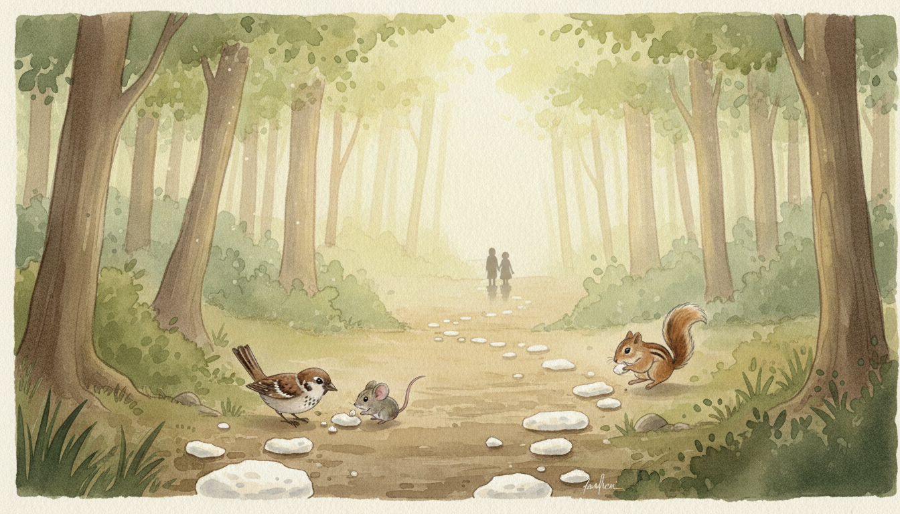
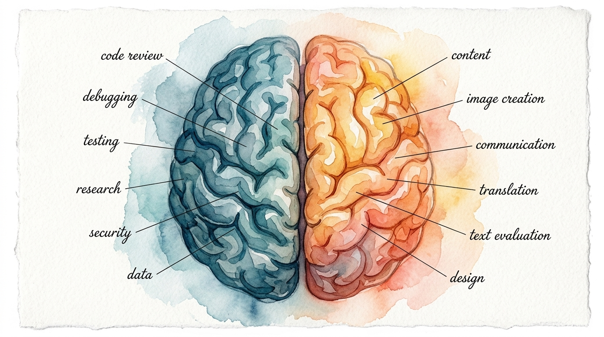

# Claude Enforcer

> **This repo might not change, but model capabilities do.** It's a good habit to run `/skill-builder audit` after any major changes to Claude Code or available models. [Keep your skills current →](#keep-your-skills-current)

> **NEW:** Meet `/route`. You no longer have to remember which skill does what. Describe the task in plain language and the router finds the right skill, picks the right function, and runs it for you. [Learn how routing works →](#routing-instead-of-freelancing)

> **PAIRS WELL WITH:** Replaces WebFetch and Chrome Browser tools in Claude with a headless stealth Playwright browser that adds CSL-JSON citations and page-health data to every page fetch. Drives local dev servers and live sites, takes screenshots, and provides authenticated session tools for debugging across projects. [Visit the repo →](https://github.com/odysseyalive/playwright-mcp)

Most people focus on what to *say* to AI. The real leverage is in what you *show* it before you speak.

[Claude Code](https://docs.anthropic.com/en/docs/claude-code) is Anthropic's command-line AI assistant for software development. When you run it in a project directory, it reads a `CLAUDE.md` file at the start of every conversation. This file is where you write the rules. Your project's architecture, coding conventions, API keys to avoid, workflows to follow. Everything Claude needs to know before it touches your code.

The problem is that rules fade. As conversations grow longer, the instructions you loaded at the start get diluted by everything that comes after. Researchers call this ["lost in the middle"](https://arxiv.org/abs/2307.03172), and it means your carefully written rules stop being consulted reliably.

This tool helps you build a context system that resists drift.



## Philosophy

| Layer | What It Is | Purpose | Drift-Resistant? |
|-------|------------|---------|------------------|
| `CLAUDE.md` | File loaded at conversation start | Universal guidance | No |
| Rules | Files in `.claude/rules/` | Always-on context (keep lean) | No |
| Skills | On-demand instruction files | Domain-specific rules | No (but refreshable) |
| Hooks | Shell scripts before actions | Hard blocks on forbidden actions | Yes |
| Agents | Subprocesses with isolated context | Independent evaluation without drift | Yes |
| Teams | Coordinated parallel instances | Collaborative implementation | Yes |

There's a tension here worth naming. Validation keeps AI honest, but too much of it keeps AI from working. Three hooks firing on every SKILL.md edit means three Claude invocations before anything lands. Skill-builder keeps the hot path cheap. Mechanical checks (grep, regex, checksum) fire on every edit. The agent-heavy validators only run when execution tooling actually reshapes a skill, and even then a deterministic precheck skips the spawn when the change is trivial. The enforcement still happens. It just stops being the bottleneck.


Each layer has its own details and tradeoffs. See [COMMANDS.md § Technical Background](COMMANDS.md#technical-background) for individual agents vs. agent teams, rules vs. skills, the optimization structure that splits SKILL.md and reference.md, and the awareness ledger that turns session knowledge into searchable memory.

## Install

Claude Code **v2.1.32 or later** is required. Skills became user-invocable in v2.1.3 (January 2026). Earlier versions refuse to run `/skill-builder` directly. Check with `claude --version` and update with `claude update` if needed.

```bash
claude /init
```

If you haven't already initialized the project. Then run the installer.

**Linux / macOS** (or Windows with Git Bash):

```bash
bash -c "$(curl -fsSL https://raw.githubusercontent.com/odysseyalive/claude-enforcer/main/install)"
```

**Windows PowerShell:**

```powershell
irm https://raw.githubusercontent.com/odysseyalive/claude-enforcer/main/install.ps1 | iex
```

Both installers ship identical content from a shared `manifest.txt`. The bundled enforcement hooks come in two variants, bash and PowerShell, so Windows keeps the mechanical backstop without Git Bash. Hooks stay dormant until wired; run `/skill-builder hooks dev skill-builder --execute` inside a session to wire the variant that matches your OS.

Then run your first audit.

```
/skill-builder audit
```

### Updating

To pull the latest version, run the installer again or use `/skill-builder update` from inside a session. See [COMMANDS.md § Maintenance](COMMANDS.md#maintenance) for both update paths.

## Hemispheric Model Delegation



Have you ever noticed that some models are good at comprehending abstract ideas, while others are really good at coding? Why rely on just one model that does everything, when you can switch between two models dynamically? Some say that's how our own brain works. Analytical processing dominates one hemisphere, while creative synthesis dominates the other. The idea here is that both AI run in parallel, each doing what it does best, passing results back and forth somewhere in the middle. Neuroscience might have debunked the left-brain/right-brain thing years ago, but it makes a great blueprint for AI. A little fake taxonomy never hurt anyone.

Why can't AI models work the same way? One writes tighter code. Another writes warmer prose. Treating them as a single tool you swap in and out mid-conversation is possible through the use of agents and skills. The switching itself is expensive. Winding down to smaller models that are good for creative work can often force content compaction. This system is designed to make the transition easier on both the model and the user.

Hemispheric delegation keeps each model in its lane. During the audit, skill-builder asks which model handles each side of the AI brain. The left brain gets your analytical model. The right brain gets your creative model. From that point forward, when a skill's workflow crosses into the other hemisphere, it doesn't stop and ask you to switch. It delegates to a focused agent pinned to the right model for that task. The agent does one job, returns the result, and the main model picks up where it left off. A creative chatbot that needs research spins up a coding-model agent for the lookup and brings the result back inline. A coding skill that needs a draft does the same in the other direction. The workflow keeps moving and the skill stays intact.

## Building & Modifying Skills

Describe what you need. `/route` finds the right skill and runs it.

```
/route I need a skill for deploying to production
```

```
/route add a rule to my deploy skill: always run tests first
```

```
/route evaluate the code I just wrote
```

```
/route audit the skills in this project
```

```
/route check this shell script for pitfalls
```

```
/route record a decision about why we chose postgres
```

The command list, formal frontmatter, hook wiring. None of that is something you need to know upfront. Route reads the skill catalog, picks the best match, and dispatches.

See [COMMANDS.md](COMMANDS.md) for the full command reference when you want to go deeper.

## Routing Instead of Freelancing

Ever build a skill that works perfectly, then watch the AI ignore it on the next task and freelance its own approach? It's not malicious. The model reaches for the most direct path through whatever tools it remembers, and our carefully built skills sit unused. The rules we codified, the directives we wrote, the hooks we wired. All of it bypassed because nothing told the AI to look.

The `route` system changes that. It has two halves.

```
/skill-builder route index
```

This builds an index of every installed skill. Names, descriptions, modes, trigger phrases. The output lives inside a new `/route` skill that the AI can consult for any task. Pass it a task description and it picks the right skill and function.

```
/route find recent papers on transformer architecture
```

```
/route summarize this URL
```

```
/route audit the skills in this project
```

The second half is `embed`.

```
/skill-builder route embed
```

This walks every installed skill and looks for places where the workflow tends to hand off to research, web search, or follow-up analysis. For each skill that has those open-ended steps, embed inserts a Route Consultation Gate. A short checkpoint that tells the AI to consult `/route` before improvising on a follow-up. The skill stays in charge of its own deterministic steps. Route catches the freelancing.

Both commands are smart on re-run. Index diffs against the prior catalog and reports what changed. Embed reconciles its consultation gates against what's already on disk. New skills get gates added. Skills that no longer need a gate get them removed. Stale gates get refreshed. The audit appends both as the last two task items, so every audit ends with a current index and current gates.

As our skill libraries grow, route makes sure the investment compounds. Build a skill once. The system finds it every time.

See [COMMANDS.md § Routing](COMMANDS.md#routing) for the full command reference.

## Catching Code Mistakes Before They Land

How many dead exports are sitting in your codebase right now? Helpers that got reinvented three files over from one that already exists. A function that grew an extra layer of abstraction for its single caller. None of it breaks the build, so none of it gets caught. Until the codebase starts feeling heavier than it should.

The `code-eval` command builds a `code-evaluator` skill that spots exactly this kind of drift. It is language-agnostic, using ripgrep and whatever native tools a project already has instead of depending on one compiler. It reads a Rust crate, a Python package, and a TypeScript app the same way.

```
/skill-builder code-eval create
```

The skill works in three layers. Before code gets written, an advisor agent checks the planned approach against the existing codebase and asks whether the thing already exists and whether it will rot. After code gets written, a reviewer agent reads the diff for dead code, duplication, and complexity. On demand, a full sweep surveys the whole tree.

```
/code-evaluator review
```

```
/code-evaluator sweep
```

Or let `/route` handle it.

```
/route check this code for dead exports and duplication
```

The safety model is deliberately strict. A grep that finds no references is a candidate, never a verdict. Only high-confidence findings that clear every false-positive guard get fixed automatically, and only when the build and the tests still pass afterward. Duplication and complexity are always left for a person to decide.

Audit ties it together. Run `/skill-builder audit` and it creates the evaluator when it's missing, keeps the detection references current as they improve, and wires the pre-write and post-write gates into every skill that writes, edits, or debugs code.

See [COMMANDS.md § Code Evaluation](COMMANDS.md#code-evaluation) for the full command reference.

## Keep Your Skills Current

Have you ever noticed a skill that used to work perfectly start under-delivering after a model update? A directive that fired reliably on 4.6 suddenly needs more explicit instructions on 4.7. A hook that felt essential two releases ago might now be redundant with a new platform feature. Our skills aren't failing. The model underneath is shifting shape, and the rules need to shift with it.

The `/skill-builder audit` command keeps that evolution manageable. It scans your CLAUDE.md, your rules, and every installed skill, and surfaces what needs attention. Directives that need enforcement annotations for the current model. Hooks that could downshift from agent to command. Oversized SKILL.md files carrying machinery that should live in a reference. Effort levels that cost more than they return. Run it after every Claude update, after anything fundamental changes in how you work with the tool, or every so often just because.

```
/skill-builder audit
```

Full scan. For a lightweight pass (frontmatter + line counts + priority fixes only):

```
/skill-builder audit --quick
```

See [COMMANDS.md § Inspection & Diagnostics](COMMANDS.md#inspection--diagnostics) for what each mode covers and when `verify` or `cascade` is the better tool for the job.

## Claude 4.7 Upgrade

Something shifted between Opus 4.6 and 4.7. 4.6 was generous. If you wrote "keep it conversational" in a skill directive, the model read between the lines. It inferred what you meant and did something close to what you wanted. 4.7 doesn't do that. It executes what the text says, nothing more. "Keep it conversational" under-executes because the model won't fill in the missing logic. "IF count < 3 → STOP" executes reliably because there's nothing to infer. The change looks like a cost at first. It's actually a discipline.

This update is what that discipline looks like, applied to every skill in the enforcer. The `convert` command walks through each skill and recalibrates. User directives stay verbatim. Sacred as always. Underneath each soft directive it generates an enforcement annotation, a numbered checkpoint that translates the intent into the explicit steps 4.7 will actually follow. Workflow steps get rewritten from inference-friendly phrasing to literal instructions. A `minimum-effort-level` lands in the frontmatter so 4.7 knows how hard to think. Where vague user input enters a skill, a Phase 0 assessment asks the clarifying questions before execution begins. The upgrade also brought token-efficiency work. Precheck-gated diff auditors. Command-first hooks instead of agent-first. Opt-in agent panels. A `strictness` field that lets a skill author opt up or down on verification cost. Not every piece of this is 4.7-only. But 4.7 is what forced the clarity.

Now the part that matters more than this release. Anthropic shipped Mythos Preview the same month 4.7 became available. Codename Capybara. A new tier, not an Opus upgrade, restricted to a small circle of critical-infrastructure partners through something called Project Glasswing. It found thousands of zero-day vulnerabilities during testing, across every major operating system and web browser. It was kept behind structured access because its autonomous capabilities were judged too dangerous for broad API release. 4.7 is the less-risky sibling that shipped alongside it. Mythos-class capabilities will reach the rest of us eventually. They always do. And the harness this project builds is not 4.7 scaffolding. Sacred directives, mechanical enforcement hooks, fresh-context validators, directive checksums, explicit execution contracts. These are the infrastructure for steering much more capable, much more autonomous models without losing the plot. 4.7 teaches us the vocabulary. Mythos will require fluency. Building the muscle now on a model that forgives less than 4.6 but more than what's coming is preparation, not paranoia.


## Learn More

- [Context Is the Interface](https://odysseyalive.com/focus/context-is-the-interface). The insight behind this approach.
- [Mrinank Sharma, Please Come Back to Work](https://odysseyalive.com/focus/mrinank-sharma-please-come-back-to-work). Why adversarial agents outperform consensus.
- [Your AI Has Amnesia](https://odysseyalive.com/focus/your-ai-has-amnesia). Why AI coding assistants forget instructions and what to do about it.

See [COMMANDS.md § Further Reading](COMMANDS.md#further-reading) for the Claude Code documentation, skills guide, agent-teams spec, and the lost-in-the-middle research.

## Acknowledgments

Special thanks to Joe Loudermilk, who helped me understand why giving an LLM a second opinion opens doors. That conversation planted the seed for everything the agent system became.

Thanks also to [Autonomee](https://www.skool.com/autonomee/about?ref=ab20c334980842ac864a041f7c84f88c) for hooking together the greatest minds in the business.

## License

MIT
